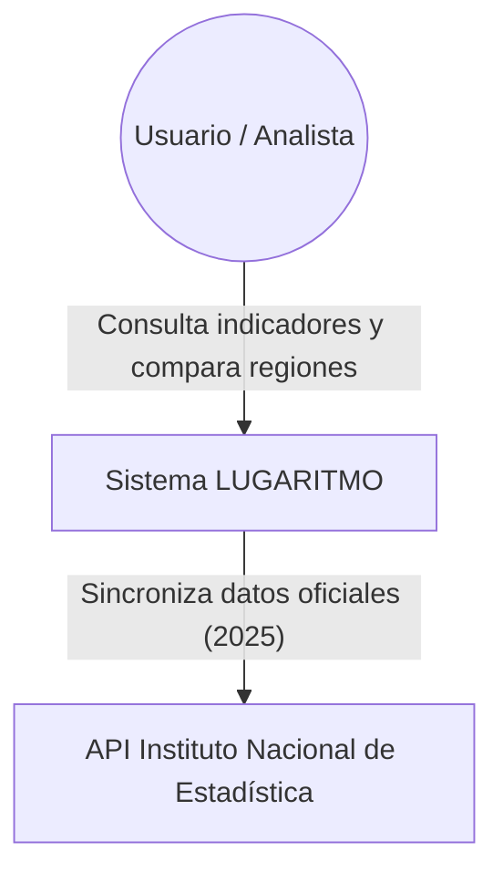
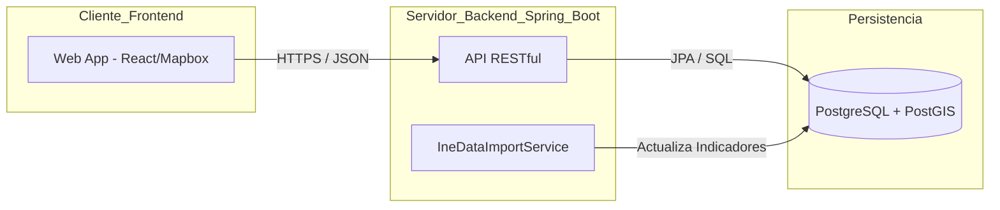

# 📄 Documento 04: Arquitectura C4

**Proyecto:** LUGARITMO
**Nivel de detalle:** Contexto, Contenedores y Componentes
**Estado:** Actualizado según ADR 002 (Arquitectura REST)

---

## 1. Nivel 1: Diagrama de Contexto
Este nivel describe la relación del sistema con los actores externos y las fuentes de datos oficiales.

---

## 2. Nivel 2: Diagrama de Contenedores
Describe las tecnologías que componen la infraestructura del proyecto y cómo se comunican entre sí mediante protocolos estándar.

---

## 3. Nivel 3: Diagrama de Componentes (Backend)
Detalle interno de la lógica en Java para la gestión de las provincias y sus indicadores.

| Componente | Responsabilidad Técnica |
| :--- | :--- |
| **ProvinceController** | Define los endpoints REST. Gestiona los Query Parameters (`indicator`, `year`). |
| **ProvinceService** | Capa de negocio. Filtra y procesa los datos antes de enviarlos al frontend. |
| **ProvinceRepository** | Gestión de persistencia mediante Spring Data JPA y consultas espaciales. |
| **IneImportService** | Cliente HTTP encargado de consumir los JSON oficiales del INE y poblar la DB. |

---

## 4. Flujo de Datos Principal
Para garantizar el cumplimiento de los Requisitos No Funcionales (RNF-01), el sistema sigue este flujo:

1.  **Capa de Presentación:** El usuario selecciona el indicador `housingPriceSqm` (Precio Vivienda) en el mapa.
2.  **Capa de Aplicación:** El frontend realiza una petición asíncrona a `/api/v1/provinces?indicator=housingPriceSqm`.
3.  **Capa de Negocio:** El backend identifica el parámetro, solicita a la base de datos solo las columnas necesarias y construye el objeto de respuesta.
4.  **Capa de Datos:** PostgreSQL devuelve los registros filtrados por provincia.
5.  **Cierre:** El frontend recibe el JSON y actualiza los colores del mapa de coropletas en tiempo real.

---

## 5. Decisiones de Diseño Clave
* **Protocolo:** Se utiliza REST sobre HTTP/S para maximizar la compatibilidad y facilidad de testeo.
* **Geometrías:** Las coordenadas de las provincias se almacenan en formato GeoJSON dentro de la base de datos para una renderización directa en el mapa.
* **Escalabilidad:** El desacoplamiento entre el servicio de importación y la API permite actualizar los datos del INE sin interrumpir el servicio al usuario.
