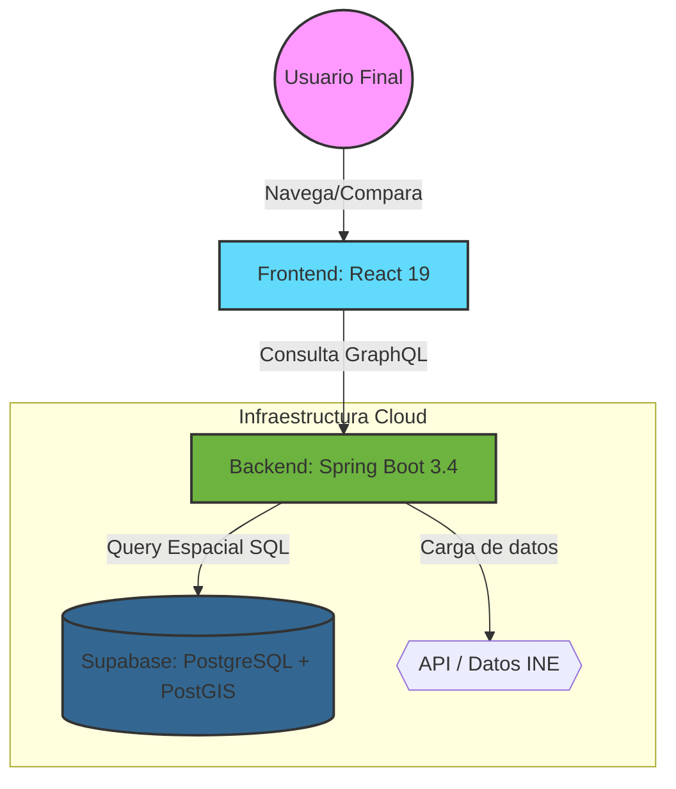

Para que **LUGARITMO** sea una obra maestra de la ingeniería, no basta con que funcione; debe ser **robusta, mantenible y elegante**. Vamos a utilizar el **Modelo C4** para la visualización de la arquitectura y el patrón de **Arquitectura Hexagonal (Puertos y Adaptadores)** para el backend, evitando así el acoplamiento y el código "espagueti".

Aquí tienes el **Documento 04: Arquitectura del Sistema**, diseñado bajo los estándares más exigentes de la industria.

---

# 🏛️ Documento 04: Arquitectura y Diseño de LUGARITMO

## 1. Diagrama C4 (Nivel 2: Contenedores)

Este diagrama muestra cómo se dividen las responsabilidades y cómo fluye la información entre los componentes.

---

## 2. Patrones de Diseño Aplicados

Para que LUGARITMO sea profesional, aplicamos estos patrones que separan la lógica de los detalles técnicos:

### A. Backend: Arquitectura Hexagonal (Puertos y Adaptadores)

Dividiremos el código en tres capas para que la lógica de "Comparar Barrios" no dependa de si usamos Supabase o cualquier otra base de datos:

1. **Dominio (Core):** Donde viven los modelos (`Territory`, `Indicator`) y las reglas de negocio (ej. lógica para calcular la desviación sobre la media).
2. **Puertos (Interfaces):** Definen qué puede hacer el sistema (ej. `TerritoryRepository`).
3. **Adaptadores (Infraestructura):** Implementaciones reales (ej. la clase que habla con Supabase o la que resuelve GraphQL).

### B. Frontend: Patrón de Contenedores y Componentes

* **Componentes de Presentación:** Se encargan solo de cómo se ve el mapa o el gráfico (UI limpia).
* **Contenedores/Hooks:** Se encargan de la lógica, como pedir los datos a GraphQL y manejar el estado del mapa.

### C. Estrategia de Datos: Singleton y Flyweight

* Usaremos **Caché en el Cliente (Apollo Client)** para que, si el usuario vuelve a consultar la renta de un barrio que ya visitó, la app no llame al servidor, ahorrando recursos y tiempo.

---

## 3. Guía de "Buenas Prácticas" (Anti-patrones a Evitar)

Para mantener la elegancia, en **LUGARITMO** prohibimos los siguientes errores comunes:

* **🚫 El Objeto Dios (God Object):** No crearemos una clase gigante llamada `LugaritmoService`. Dividiremos la lógica en servicios pequeños: `EconomyService`, `HealthService`, `GeoService`.
* **🚫 Acoplamiento al Modelo del INE:** Los nombres de las variables en nuestro código serán claros (`rentaMedia`), nunca usaremos los códigos crípticos del INE directamente en la lógica del negocio.
* **🚫 Anemic Domain Model:** Nuestros objetos de dominio no serán solo "bolsas de datos" (getters y setters). Tendrán comportamiento y validaciones propias.

---

## 4. Flujo de Datos Elegante (Diagrama de Secuencia)

¿Qué pasa cuando el usuario hace clic en un barrio?

1. **Frontend:** Detecta el clic y lanza una `Query` de GraphQL.
2. **Backend:** El `Resolver` de GraphQL recibe la petición y llama al `Service` de Dominio.
3. **Repositorio:** Realiza una consulta **PostGIS** para extraer la geometría y el valor socioeconómico en una sola operación optimizada.
4. **Respuesta:** El dato viaja en JSON, el mapa se pinta con **MapLibre** y el gráfico con **Recharts**.

