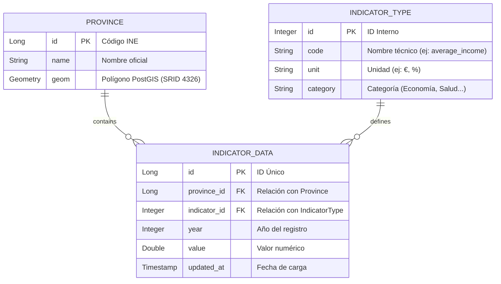

# 📄 Documento 05: Modelo de Datos (Normalizado)

**Proyecto:** LUGARITMO
**Motor:** PostgreSQL + PostGIS
**Enfoque:** Escalabilidad Horizontal para AWS (Relacional Normalizado)

---

## 1. Diagrama Entidad-Relación (ER)

Este modelo separa la geografía de los indicadores para permitir el crecimiento ilimitado de datos sin modificar la estructura de las tablas.



---

## 2. Scripts SQL de Creación (DDL)

Copia y ejecuta este código para generar la estructura completa:

```sql
-- 1. Habilitar la extensión espacial
CREATE EXTENSION IF NOT EXISTS postgis;

-- 2. Tabla de Provincias (Información Geográfica Estática)
CREATE TABLE provinces (
    id BIGINT PRIMARY KEY, -- Código oficial del INE
    name VARCHAR(100) NOT NULL,
    geom GEOMETRY(MultiPolygon, 4326) NOT NULL -- Datos espaciales para el mapa
);

-- 3. Tabla de Tipos de Indicadores (Metadatos)
CREATE TABLE indicator_types (
    id SERIAL PRIMARY KEY,
    code VARCHAR(50) UNIQUE NOT NULL, -- Ej: 'unemployment_rate'
    unit VARCHAR(20),                -- Ej: '%'
    category VARCHAR(50)             -- Ej: 'Economy'
);

-- 4. Tabla de Datos (Valores Dinámicos)
CREATE TABLE indicator_data (
    id SERIAL PRIMARY KEY,
    province_id BIGINT REFERENCES provinces(id) ON DELETE CASCADE,
    indicator_id INTEGER REFERENCES indicator_types(id) ON DELETE CASCADE,
    year INTEGER NOT NULL,
    value DOUBLE PRECISION NOT NULL,
    updated_at TIMESTAMP DEFAULT CURRENT_TIMESTAMP
);

-- 5. Índices de Rendimiento para AWS/Escalabilidad
CREATE INDEX idx_provinces_geom ON provinces USING GIST (geom);
CREATE INDEX idx_data_query ON indicator_data (indicator_id, year);
```

---

## 3. Descripción de las Tablas

1.  **`provinces`**: Actúa como el inventario de territorios. Almacena las siluetas que se pintarán en el mapa. Al estar separada, la geometría (que es pesada) no se duplica innecesariamente.
2.  **`indicator_types`**: Es el catálogo de métricas. Permite que el sistema sea extensible; si en el futuro quieres medir la "Calidad del Aire" o "Crimen", solo insertas una nueva fila aquí sin tocar el código Java.
3.  **`indicator_data`**: Es la tabla de hechos. Registra el valor numérico cruzando una provincia con un indicador y un año específico. Es óptima para realizar comparativas históricas.


```sql
SELECT p.name, d.value, t.unit
FROM indicator_data d
JOIN provinces p ON d.province_id = p.id
JOIN indicator_types t ON d.indicator_id = t.id
WHERE t.code = 'unemployment_rate' AND d.year = 2025;
```
